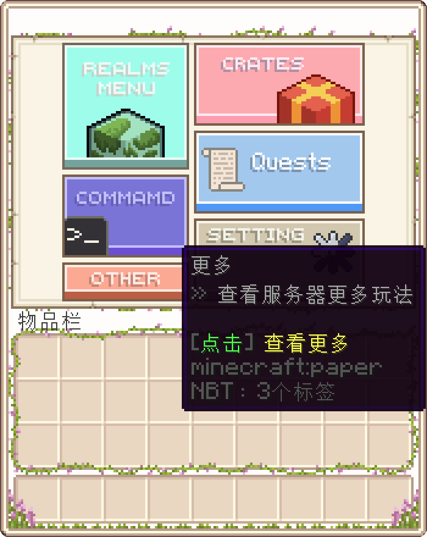
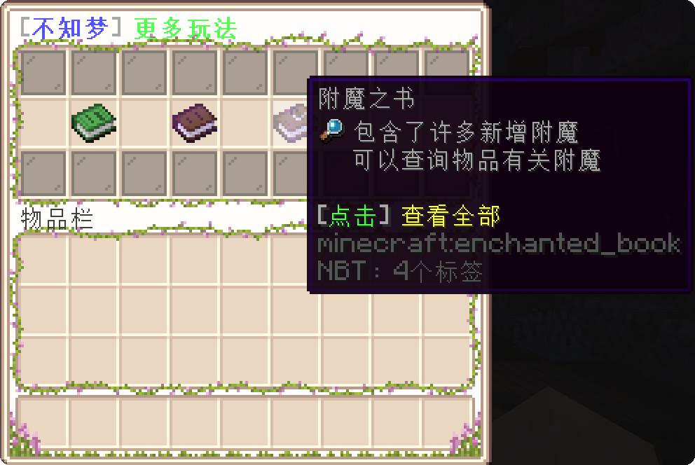
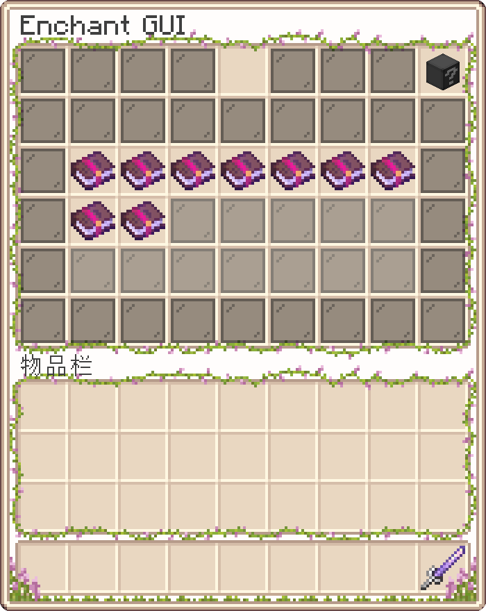
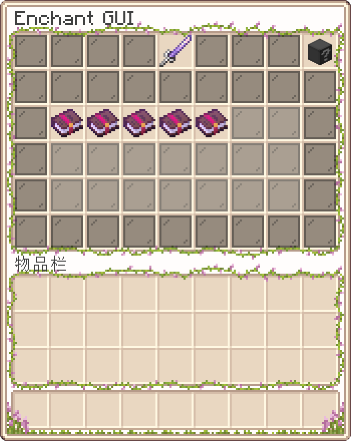

# 更多附魔 More Enchant

> **更多附魔** 插件给开发组提供了很多个性化设置，让开发组能够跟容易创建出自己想要的附魔。

(⁎⁍̴̛ᴗ⁍̴̛⁎) 谁不喜欢词条花花绿绿，强度拉满的满级武器呢？

---

## 1. 附魔介绍

想查看附魔列表，你可以通过点击菜单里的 `Other` 选项卡的 **附魔之书**。

 

之后你会进入到附魔菜单，这里面显示了全部的可用附魔

你可以讲你想查询的武器/工具放入顶部空位中查询该物品可用附魔

 

---

## 2. 该如何获取这些附魔？

要事先说明一下，大部分的强力附魔是无法通过 MC 原版手段获取的，如附魔台，战利品箱，村民交易。

所以这一类的附魔书有以下几种途径获取：

1. 完成 NPC 的主线任务可获取对应职业的高级附魔
2. 击杀野外 BOSS 可掉落对应群系/生物的附魔书/附魔武器
3. 在协会中找 NPC `附魔师` 对话可打开 **附魔商店**

---

### 3. 附魔！

当你已经拥有了许多特殊的附魔书，你便可以将它们全都敲到你的装备上了。

与原版附魔书一样，把装备和附魔书扔到 **铁砧** 上，消耗经验值敲就可以了。

 

不过要注意一点：
1. 能力类附魔在每个物品上只能存在一个。
2. 粒子类附魔除了好看没有任何特殊增益。*（如果你说魅力增益也算增益的话——）*
3. 类似于原版附魔书，特殊附魔书也可以用两本同等级合成一本更高等级的。

