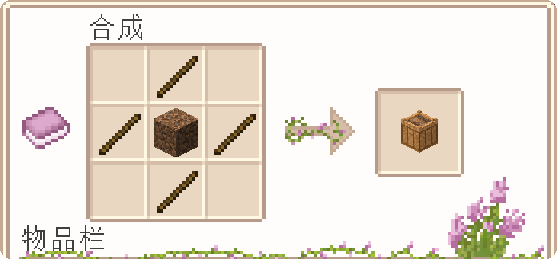
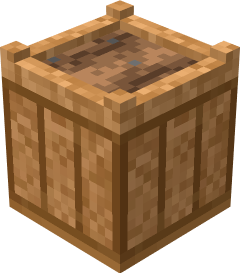
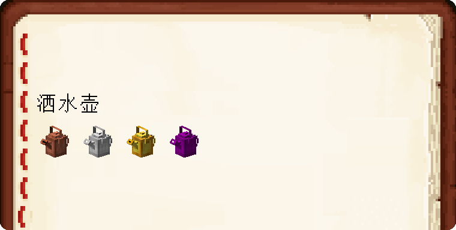
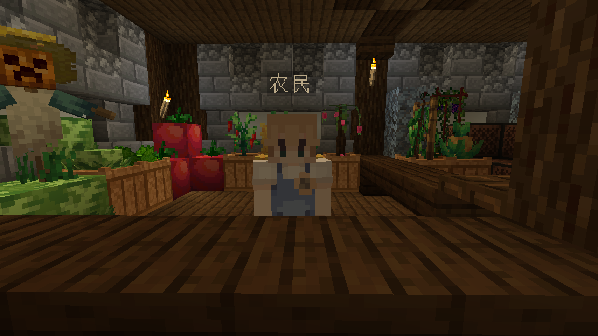
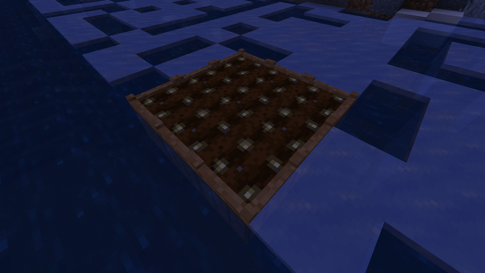

# 更多农作物 More Crops

> **更多农作物** 是由插件 & 材质包为基础，给玩家提供各式各样的农作物。

∠( ᐛ 」∠)＿ 美好的一天开始啦，请问你今天浇水了吗？

---

## 1. 更多农作物的介绍

**种植盆** 是新的种植方块，由四根木棍和一个泥土制作而成。

<!--  -->

**洒水壶** 是整个农业生涯较为重要的一件工具，玩家可以给干燥的种植盆浇水。

---

## 2. 如何获取新的作物种子？

玩家们在 **[冒险协会]** 负一层能找到下图所示的 NPC，与他初次对话会赠予你 10 个大蒜种子和 1 个铜质洒水壶。

> 注意，当前版本洒水壶暂时无法制作，只能通过 NPC 对话或在 NPC 处购买。

获取到种子与洒水壶后，寻找到一处你心仪的地方开始你的种田时光吧！

洒水壶拿在手上对着任意一处水源右键即可装水，对着种植盆右键浇水。

> 注意，大部份农作物在冬季会枯萎，同时农作物如果水份不足也有可能会枯萎，请时刻记得给作物浇水

---

## 3. 其他问题

Q：<u>如果我想获取其他种子该怎么办？</u>

A：当前版本种子获取只能通过 NPC 商店进行购买，后续版本会添加更多获取作物种子的方式。

 

Q：<u>如果想在冬季种植作物该怎么办？</u>

A：可以制作 **温室玻璃** 进行防寒措施，温室玻璃的 Y 轴有效范围是 5 格。

 

Q：<u>新的农作物能干嘛？</u>

A：卖钱，后续版本会添加更多食物配方，丰富玩家们的饮食。